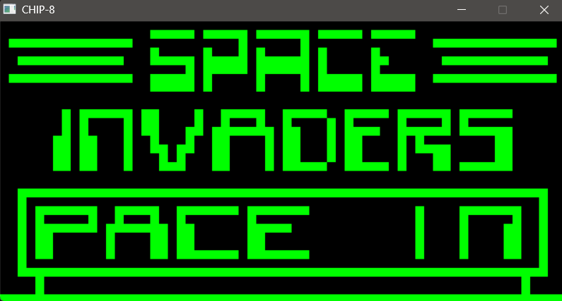
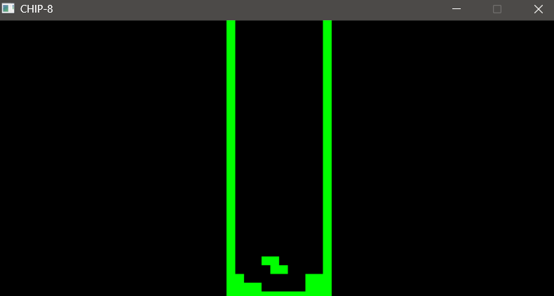
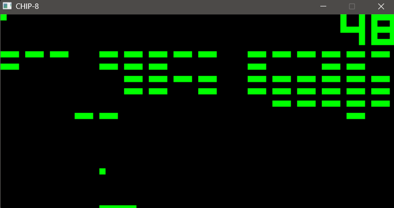

# CHIP-8 Emulator

A small **CHIP-8 emulator** written in **C++**.

The project implements the CHIP-8 virtual machine, including opcode execution, memory, registers, timers, input, and display rendering.

## Features

- CHIP-8 CPU and memory
- Opcode decoding and execution
- 16 general-purpose 8-bit registers
- Delay and sound timers
- 64×32 monochrome display
- Keyboard input
- SDL-based rendering

## Screenshots

<p align="center">
  
  
  
</p>

## Run

Pass the CHIP-8 ROM path as a command-line argument:

```powershell
chip8.exe ..\roms\Space_Invaders.ch8
```
